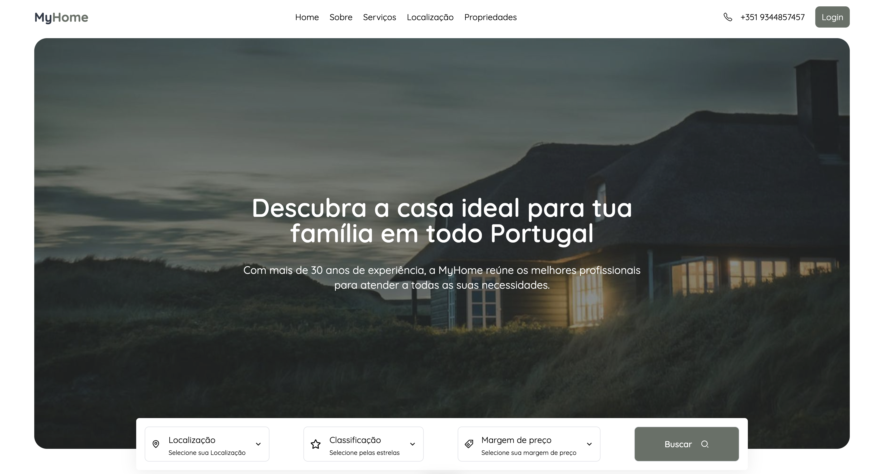
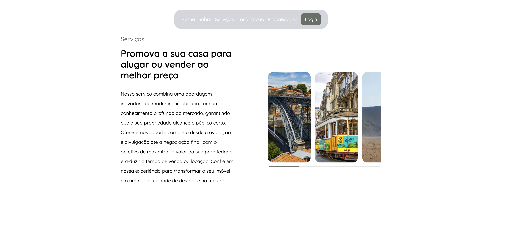
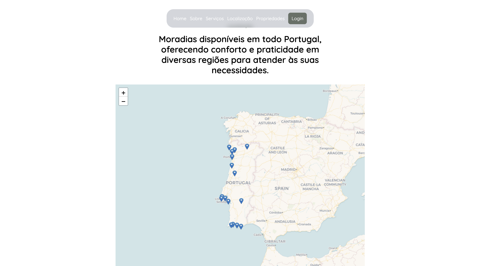
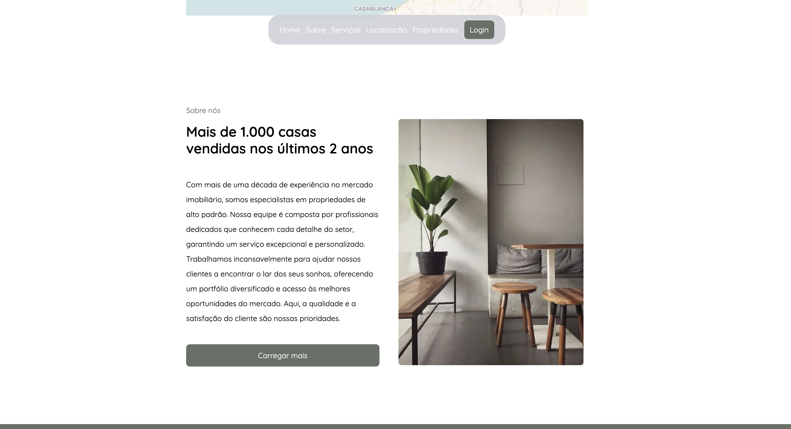
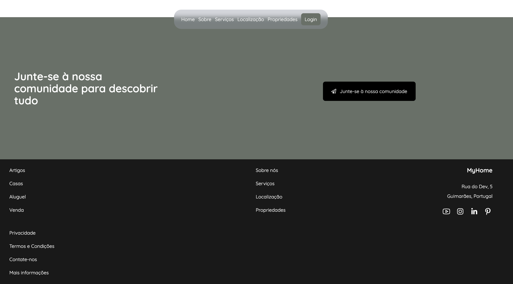
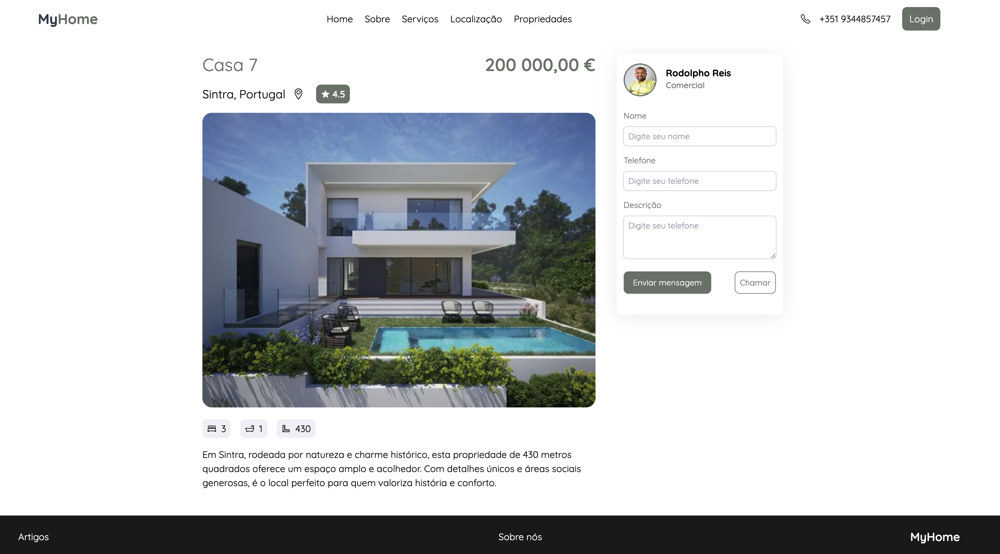

# Home

## Deploy
Este projeto está disponível online. Acesse a versão deployada [aqui](https://myhome-mocha.vercel.app/) (clique com o botão direito e escolha "Abrir link em uma nova aba").

## Instalação
Para começar a usar este projeto, siga estas etapas:

1. Clone o repositório:
   ```bash
   git clone git@github.com:rodolphoreis/home.git
   cd home
   
   ```

2. **Inicie o servidor de desenvolvimento:**

   ```bash
   npm install

   ```

3. **Inicie o servidor de desenvolvimento:**
    ```bash
   npm run dev

   ```
   

4. **Abra o navegador e navegue até** [http://localhost:3000](http://localhost:3000) para a aplicação.


## Funcionalidades

- Busca de Propriedades: Encontre a casa dos seus sonhos com uma função de busca intuitiva.
- Design Responsivo: O aplicativo é otimizado para todos os dispositivos, garantindo uma boa experiência de usuário em desktops e dispositivos móveis.
- Transições Suaves: Utiliza Framer Motion para animações e transições que aprimoram a interface do usuário.
- Interação com Mapas: Implementado Leaflet para exibir mapas interativos.
- Gerenciamento de Estado: Utiliza a Context API do React para um gerenciamento de estado eficiente.
- 
## Imagens do Projeto

  
_Home_

  
_Home_

  
_Home_


  
_Home_

  
_Home_

  
_Home_

  
_Detalhes_


##  Tecnologias Utilizadas

- Frontend: Next.js, React, Tailwind CSS, Framer Motion, React Leaflet.
- Gerenciamento de Estado: Context API do React.

## Contribuição

Contribuições são bem-vindas! Se você gostaria de contribuir para este projeto, por favor, faça um fork do repositório e envie um pull request com suas alterações.
